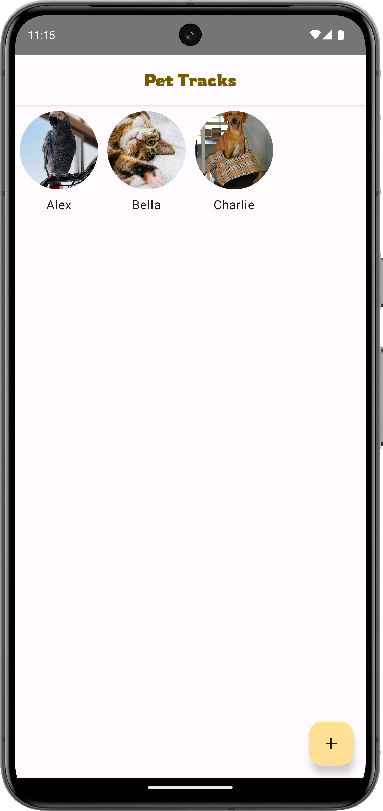
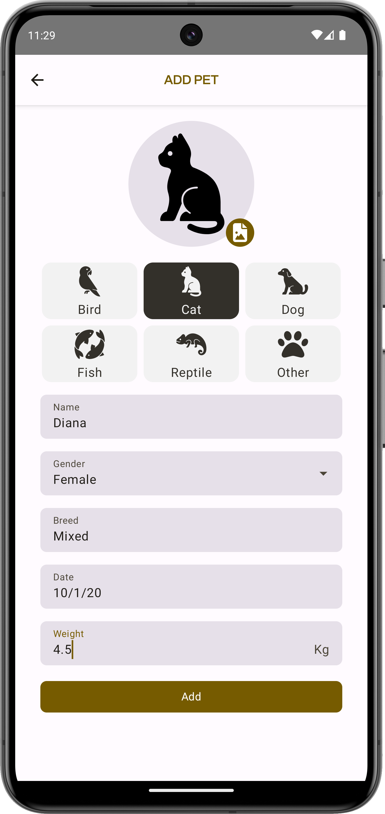
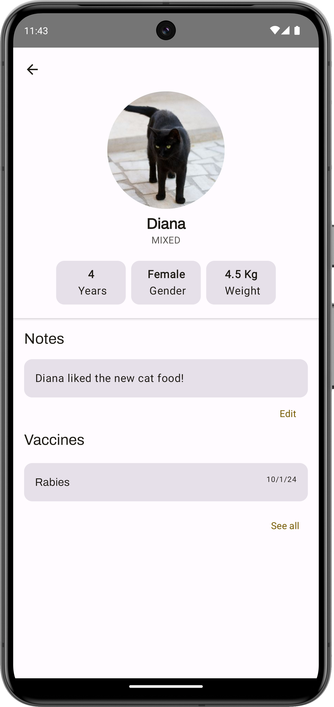

# 🚧 Pet Tracks🐾 - *Work In Progress* 🚧

Pet Tracks is an Android application developed with Room, Hilt, Jetpack Compose, Flow, and
Coroutines to help pet owners track important information about their pets, such as vaccinations and
notes.

## Screenshots

    

## Available Languages

The app is available in both [English](README.md) and [Brazilian Portuguese](README.pt-br.md).

## Key Features

- Registration of pet owner's pet data, such as name, breed, age, etc.
- Addition of important dates, such as vaccinations and notes.
- Viewing and editing of pet data.

## Technologies Used

- Room: Persistence library for storing pet data locally.
- Hilt: For dependency injection.
- Jetpack Compose: For declaratively building the user interface efficiently.
- Flow: For asynchronous data flow.
- Coroutines: For managing asynchronous operations.
- Android Jetpack: Set of components to help with Android app development.

## Installation Requirements

- Android device running version 7 (Nougat) or higher.

## License

This project is licensed under the [MIT License](https://opensource.org/licenses/MIT) - see
the [LICENSE.md](LICENSE) file for details.

**Icons**

- [Font Awesome](https://fontawesome.com/)
- [Domestic animals](https://thenounproject.com/browse/collection-icon/domestic-animals-156132/)